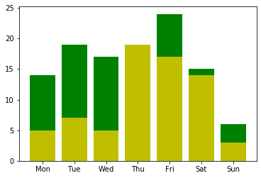
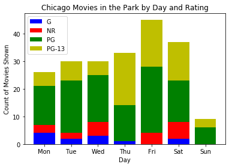

# Pandas Warmup

Pandas out yer ears

## Data setup

Import: 

- Pandas under the alias 'pd'

- Matplotlib.pyplot under the alias 'plt'

Run:
- %matplotlib inline


```python

```


```python
#__SOLUTION__

#data manip
import pandas as pd

#data viz
import matplotlib.pyplot as plt

#jn commands
#run charts below cells
%matplotlib inline 
```

#### Make a dataframe by reading in the csv 'Chicago_Park_District__Movies_in_the_Parks_2019' which is in the "data" folder  

#### Assign the dataframe to the variable 'movies'

#### Look at the first five rows


```python

```


```python
#__SOLUTION__

movies = pd.read_csv('data/Chicago_Park_District__Movies_in_the_Parks_2019.csv')

movies.head()
```


<div>
<style scoped>
    .dataframe tbody tr th:only-of-type {
        vertical-align: middle;
    }

    .dataframe tbody tr th {
        vertical-align: top;
    }

    .dataframe thead th {
        text-align: right;
    }
</style>
<table border="1" class="dataframe">
  <thead>
    <tr style="text-align: right;">
      <th></th>
      <th>Day</th>
      <th>Date</th>
      <th>Park</th>
      <th>Park Phone</th>
      <th>Title</th>
      <th>CC</th>
      <th>Rating</th>
      <th>Underwriter</th>
      <th>Park Address</th>
      <th>Location</th>
    </tr>
  </thead>
  <tbody>
    <tr>
      <td>0</td>
      <td>Mon</td>
      <td>08/12/2019</td>
      <td>River Park</td>
      <td>(312) 742-7516</td>
      <td>Hotel Transylvania 3</td>
      <td>Y</td>
      <td>PG</td>
      <td>NaN</td>
      <td>5100 N. Francisco Ave.</td>
      <td>(41.97406838, -87.70144885)</td>
    </tr>
    <tr>
      <td>1</td>
      <td>Thu</td>
      <td>07/18/2019</td>
      <td>Hoard Playground Park</td>
      <td>(773) 256-1903</td>
      <td>Black Panther</td>
      <td>Y</td>
      <td>PG-13</td>
      <td>NaN</td>
      <td>7201 S. Dobson Ave.</td>
      <td>(41.7640317, -87.59928813)</td>
    </tr>
    <tr>
      <td>2</td>
      <td>Fri</td>
      <td>06/07/2019</td>
      <td>Berger Park Cultural Center</td>
      <td>(773) 761-0376</td>
      <td>Some Like It Hot</td>
      <td>Y</td>
      <td>NR</td>
      <td>NaN</td>
      <td>6205 N. Sheridan Rd.</td>
      <td>(41.99480562, -87.65538421)</td>
    </tr>
    <tr>
      <td>3</td>
      <td>Sat</td>
      <td>07/13/2019</td>
      <td>Skinner Park</td>
      <td>(312) 746-5560</td>
      <td>Big Hero 6</td>
      <td>Y</td>
      <td>PG</td>
      <td>The Museum of Science and Industry</td>
      <td>1331 W. Monroe St.</td>
      <td>(41.88015941, -87.66077867)</td>
    </tr>
    <tr>
      <td>4</td>
      <td>Wed</td>
      <td>07/24/2019</td>
      <td>Kilbourn Park</td>
      <td>(773) 685-3351</td>
      <td>El Reality</td>
      <td>Y</td>
      <td>NR</td>
      <td>The International Latino Cultural Center</td>
      <td>3501 N. Kilbourn Ave.</td>
      <td>(41.94450485, -87.73951111)</td>
    </tr>
  </tbody>
</table>
</div>


#### What kind of type is the data in the Date column?  Turn it into a datetime type if it's not already


```python

```


```python
#__SOLUTION__

print(movies.dtypes)

movies.Date = pd.to_datetime(movies.Date)
```

    Day                      int64
    Date            datetime64[ns]
    Park                    object
    Park Phone              object
    Title                   object
    CC                      object
    Rating                  object
    Underwriter             object
    Park Address            object
    Location                object
    area_code               object
    dtype: object


#### Replace the Day column with an integer for the day of the week derived from the datetime object in the Date column 

[*Hint*](https://pandas.pydata.org/pandas-docs/stable/reference/api/pandas.DatetimeIndex.dayofweek.html)


```python

```


```python
#__SOLUTION__
movies.Day = pd.Categorical(
    movies.Day, 
    categories = ['Mon', 'Tue', 'Wed', 'Thu', 'Fri', 'Sat', 'Sun'],
    ordered=True
    )
```


    105    Mon
    84     Mon
    28     Mon
    185    Mon
    23     Mon
          ... 
    138    Sun
    44     Sun
    33     Sun
    179    Sun
    184    Sun
    Name: Day, Length: 210, dtype: category
    Categories (7, object): [Mon < Tue < Wed < Thu < Fri < Sat < Sun]


## Data Exploration

#### What is the most frequent place to show a movie?  (Remember that there might be a tie!)


```python

```


```python
#__SOLUTION__
venue_counts = (
    movies
    .Park
    .value_counts()
)

max_spot = venue_counts.max()

venue_counts[venue_counts==max_spot].index.tolist()
```


    ['Ward (A. Montgomery) Park']


#### Are there more 773 or 312 area codes for places where movies are shown?  


```python

```


```python
#__SOLUTION__
movies['area_code'] = [num[1:4] for num in movies['Park Phone']]

movies.area_code.value_counts()
```


    312    151
    773     58
    317      1
    Name: area_code, dtype: int64


#### Group the data by what day of the week the movies are shown using `.groupby()`

#### Assign to the variable "movies_grp_day" (what type of object is this?)


```python

```


```python
#__SOLUTION__

movies_grp_day = movies.groupby('Day')

type(movies_grp_day)
```


    pandas.core.groupby.generic.DataFrameGroupBy


#### Select just the movies shown on Monday (what type of object is *this*?)


```python

```


```python
#__SOLUTION__

movies_mon = movies_grp_day.get_group('Mon')

type(movies_mon)
```

#### Using `movies_grp_day`, get the modal rating shown each day

*Hint: look at [the groupby documentation](https://pandas.pydata.org/pandas-docs/version/0.23.4/generated/pandas.core.groupby.DataFrameGroupBy.agg.html) and write a function*


```python

```


```python
#__SOLUTION__

def groupby_mode(gm_group):
    '''
    Returns the modal value for a group in a groupby object
    
    Parameters:
        gm_group: group of a groupby object
    
    Returns:
        list of modal values in gm_group
    '''
    values = gm_group.value_counts()
        
    mode_list = list(
        values[
            values==values.max()
        ]
        .index
    )
    
    #what does this do? why only apply it when len==1?
    if len(mode_list)==1:
        mode_list = mode_list[0]
     
    return mode_list
    
movies_grp_day['Rating'].agg(
    lambda x: 
    groupby_mode(x)
)
```


    Day
    Fri       PG
    Mon       PG
    Sat       PG
    Sun       PG
    Thu    PG-13
    Tue       PG
    Wed       PG
    Name: Rating, dtype: object


## Strrretch Goal

#### Make a stacked bar chart showing the ratings of movies across days of the week using fig and ax objects

#### Title the x-axis "Days of the Week"

#### Title the y-axis "Number of Movies Shown"

#### Title the chart as a whole "Chicago Movies in the Park by Days and Rating"

[*Hint*](https://matplotlib.org/3.1.1/gallery/lines_bars_and_markers/bar_stacked.html)


```python

```


```python
#__SOLUTION__


movie_day_ratings = (
movies
    .groupby(['Day', 'Rating'])['Day', 'Rating']
    .count()
    .unstack()
    .drop(['Rating'], axis=1)
    .unstack()
    .reset_index()
    .drop('level_0', axis=1)
    .rename(columns={0:'Count'})
)


fig, ax = plt.subplots()
for x in movie_day_ratings.index:
    ax.bar(
        movie_day_ratings['Day'][x], 
        movie_day_ratings['Count'][x],
        color=color_map[movie_day_ratings['Rating'][x]]
          )

movies_grp_day.get_group('Fri')['Rating'].value_counts()

def rating_counts(day):
    counts = movies_grp_day.get_group(day)['Rating'].value_counts()

    counts.sort_values(ascending=True, inplace=True)

    zipped = [list(x) for x in zip(counts.index, counts.values)]

    zipped = [rating+[day] for rating in zipped]
    print(zipped)
    return zipped
    
def bar_chart(x, y, leg):
    return ax.bar(x,y, legend=leg)

# [
#     ax.bar(rating[2], rating[1], label=rating[0]) 
#     for 
#     rating 
#     in 
#         [rating_counts(day) 
#          for 
#          day 
#          in 
#          movies.Day.unique()
#     ]
# ]
```





```python
#__SOLUTION__

#Turn Day column into an ordered categorical and sort
movies.Day = pd.Categorical(
    movies.Day, 
    categories = ['Mon', 'Tue', 'Wed', 'Thu', 'Fri', 'Sat', 'Sun'],
    ordered=True
    )

movies.sort_values('Day', ascending=True, inplace=True)

#create figures
fig, ax = plt.subplots()
color_map = dict(zip(['NR', 'G', 'PG', 'PG-13'], ['r','b','g','y']))

#this will store info for the legend
reps = []

#for each day:
for index, day in enumerate(movies.Day.unique()):
    
    #get series with index rating and values play count
    counts = movies_grp_day.get_group(day)['Rating'].value_counts()
    
    #sort so ratings are in the same order each day
    counts = counts.sort_index(ascending=True)
    
    #get all the information we need for each graph in one object
    #store as (rating, play count, day)
    zipped = [rating+[day] 
              for rating 
              in 
                  [list(x) 
                   for x 
                   in zip(
                       counts.index, 
                       counts.values
                   )
                  ]
             ]
    
    #track where to start each stacked bar 
    lower=0
    
    #for each rating per day
    for rating in zipped:
        
        #extract (rating, play count, day) and use to graph
        rep, = ax.bar(rating[2], 
               rating[1], 
               color=color_map[rating[0]],
               bottom=lower       
        ) 
        
        #set bottom of next bar at top of graphed one
        lower=rating[1]+lower
        
        #append graph info for legend
        reps.append(rep)
        
#graph metadata
ax.legend(handles=reps, labels=['G', 'NR', 'PG', 'PG-13'])
ax.set_xlabel('Day')
ax.set_ylabel('Count of Movies Shown')
ax.set_title('Chicago Movies in the Park by Day and Rating')
plt.show()
```





```python

```


```python

```


```python

```
